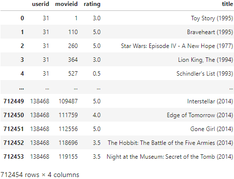

# **ThanoSQL LightFM Recommender System**
## **Tutorial Guideline :**
이번 튜토리얼에서는 데이터 분석가에게 LightFM 추천 모델을 소개합니다. ThanoSQL을 사용하면 표준 SQL 쿼리문을 통해 머신러닝 모델을 만들고 실행할 수 있습니다. 목표는 SQL 실무자가 광범위한 프로그래밍 스킬, 머신러닝에 대한 지식 없이도 간단한 쿼리문으로 모델을 빌드할 수 있도록 지원하여 머신러닝을 대중화하고 데이터 이동의 필요성을 제거하여 개발 속도를 향상시키는 것입니다.

이 가이드에서는 Kaggle의 Movielens 데이터 세트와 Goodbooks 데이터 세트를 사용하여 평점(explicit-feedback)을 활용한 LFM모델을 만들어 아이템 ID와 사용자 ID를 기반으로 추천 리스트를 생성하는 방법을 알아봅니다.

Movielens 데이터 세트에는 사용자가 영화에 부여한 평점(1~5점)과 장르 등의 영화 메타데이터가 포함됩니다.
Goodbooks 데이터 세트에는 사용자가 도서에 부여한 평점(1~10점)과 장르 등의 도서 메타데이터가 포함됩니다.

<br>

## **Model Description :**
    - 모델 설명 : Light FM 모델은 추천시스템의 Cold-start 문제를 최소화 시키기 위해 Lyst사에서 제안된 모델로 Content-based 와 Collaborative Filtering의 장점을 결합한 하이브리드 모델입니다. 메타데이터의 모든 아이템과 유저를 행렬분해알고리즘 (Matrix Factorization)을 사용하여 Latent vector로 임베딩이 되어집니다. 새로운 유저나 아이템을 추천할 수 있습니다.
    임베딩된 값들은 확률적 경사하강법 (Stochastic gradient descent)을 통해 학습이 되어집니다. 여기에는 아래의 4가지 손실(Loss) 함수들이 사용이 가능합니다. Thanosql 에서는 별도의 함수 선택이 없을때는 전반적으로 성능이 좋은 WARP를 손실함수로 사용합니다.

* logistic: 스코어가 긍정(1) 또는 부정(-1)로 표현이 될 때 유용하게 사용되는 손실함수 입니다.

* BPR: Bayesian Personalised Ranking Pairwise loss. Positive 샘플과 무작위로 선택된 negative sameple 사이의 예측 차이를 최대화 합니다. Positive interaction만 있고 ROC AUC를 최적화하려는 경우에 유용합니다.

*  WARP: Weighted Approximate-Rank Pairwise loss. 순위 위반 사례를 찾기 위해 negative(0) 사례를 반복적으로 샘플링하여 positive(1) 사례의 순위를 최대화합니다. 데이터가 positive interaction 만 존재하고, 추천 목록의 상위 리스트 (precision@k)를 최적화 하려는 경우에 유용합니다.

*  k-OS WARP: k-th Order Statistic loss. WARP 손실함수의 수정버젼으로 주어진 특정 유저의 아이템-유저 쌍 업데이트를 위해 k번째의 positive 사례를 기준으로 사용하는 WARP 손실함수의 수정버젼 입니다.


<br>

## **Intended uses & Limitation**
- 먼저 ThanoSQL LFM 모델은 SQL 실무자가 별도의 코딩작업 없이 간단하게 쿼리문만으로 추천리스트를 만들수 있도록 도와줍니다.
- 'UserID', 'ItemID', 'Rating' 칼럼이 존재하는 테이블만 있으면 추천모델을 만들 수 있습니다.
- Python, Java, 또는 C 언어등과 같은 광범위한 프로그래밍 스킬, 머신러닝에 대한 깊은 이해 없이 표준 SQL 쿼리문으로 간단하게 모델 빌드를 위한 데이터 전처리를 작업을 할 수 있습니다.
- SQL 실무자는 빌드된 모델을 사용하여 Predict 함수를 통해 User to Item, Item to User, Item to Item 세가지 형식으로 추천 리스트를 만들수 있습니다.
- LFM 모델은 Matrix Factorization 알고리즘을 사용하기 때문에 데이터가 커지면 계산량이 많아져 컴퓨터에 과부화가 올수 있습니다. (데이터의 크기가 일정기준 이상 넘어가면 시간기준으로 테이블을 분리하여 추천 모델을 만드는것을 추천합니다)

<br>
<br>

# **Movielens데이터셋을 사용하여 평점기반 추천 모델 구축과 추천 리스트 생성해보기**
## **데이터셋 Thanosql db 에 업로드**
로컬환경에 저장되어 있는 `movielens.csv` 파일을 표준 SQL 쿼리를 사용하여 ThanoSQL DB에 업로드 합니다.
```postgresql
CREATE TABLE movielens_train
(
    userid      int not null,
    movieid     int not null,
    rating      float not null,
    title       varchar(5000) not null
);
COPY movielens_train from '/your local data directory/movielens.csv' delimiter ',' csv header;
```


<br>

## **데이터셋 확인**
ThanoSQL DB에 저장되어 있는 Movielens 샘플 데이터 셋을 표준 SQL 쿼리를 사용하여 확인합니다.

`movielens_train` 데이터셋은 'userid', 'movieid', 'rating', 'title' 정보를 담고 있는 테이블입니다. 이 데이터셋은 ThanoSQL DB에 저장되어 있어 아래의 쿼리를 실행하여 불러올 수 있습니다.  
```POSTGRESQL
SELECT * FROM movielens_train
```


<br>

## **추천 모델 빌드**
이전 단계에서 확인한 Movielens 샘플 데이터를 사용하여 명시적 추천 모델을 만듭니다. 샘플데이터로부터 '사용자ID', '아이템ID', '평점' 칼럼 이름을 지정해주고 LFM 모델을 만들고 학습합니다.
```POSTGRESQL
BUILD MODEL movie_rec
USING Light_FM
OPTIONS (   user_col='userid',
            item_col='movieid',
            rating_col='rating',
            item_names= 'title'
        )
AS SELECT * FROM movielens_train
```
<br>

>### **쿼리 세부정보**
>```BUILD MODEL``` 쿼리를 사용하여 movie_rec 이라는 모델을 만들고 학습시킵니다.
>```OPTIONS(user_col='userid',item_col='movieid',rating_col='rating', item_names= 'title', ...)``` 쿼리는 모델 생성에 필수적으로 필요한 movielens 샘플데이터셋의 유저칼럼이름, 아이템칼럼이름, 평점칼럼 이름들을 할당하여 데이터셋 전처리 및 모델 빌드가 가능하도록 합니다. 모델의 파라미터 튜닝 옵션들 또한 사용이 가능합니다. Options에 따로 파라미터 할당을 하지 않으면 기본적인 파라미터 값으로 모델이 생성됩니다. 사용가능한 파라미터에 대한 설명은 https://making.lyst.com/lightfm/docs/lightfm.html 를 통해 확인할 수 있습니다.
<br>
<br>

## **빌드 완료된 모델 사용하여 USER TO ITEM 예측하기**
이전 단계에서 빌드한 추천 모델을 사용하여 유저가 좋아할만한 아이템 리스트를 생성합니다.

```POSTGRESQL
PREDICT USING movie_rec
OPTIONS (predict_type='predict_user', user_id=1, nrec=10)
AS SELECT * FROM movielens_train
```
<br>

>### **쿼리 세부정보**
>```PREDICT USING``` 쿼리는 이전 단계에서 생성한 movie_rec 이라는 모델을 사용하여 예측하게 합니다.
```OPTIONS(predict_type='predict_user', user_id=1, nrec=10, ...)``` 쿼리는 ```predict_type='predict_user', user_id=1, nrec=10``` 를 지정하여 유저ID 1번이 좋아할만한 아이템 10개를 예상하여 리스트를 만들어 출력합니다.

<br>
<br>

## **빌드 완료된 모델 사용하여 ITEM TO USER 예측하기**
이전 단계에서 빌드한 추천 모델을 사용하여 새로운 아이템을 좋아할만한 유저 리스트를 생성합니다.


```POSTGRESQL
PREDICT USING movie_rec
OPTIONS (predict_type='predict_item', item_id=1, nrec=10)
AS SELECT * FROM movielens_train
```
<br>

>### **쿼리 세부정보**
>```PREDICT USING``` 쿼리를 사용하여 이전 단계에서 생성한 movie_rec 이라는 모델을 사용하여 예측하게 합니다.
```OPTIONS(predict_type='predict_item', item_id=1, nrec=10, ...)``` 쿼리는 ```predict_type='predict_item', item_id=1, nrec=10``` 를 지정하여 아이템ID 1번을 좋아할만한 유저 10명을 예상하여 리스트로 출력합니다.

<br>
<br>

## **빌드 완료된 모델 사용하여 ITEM TO ITEM 예측하기**
이전 단계에서 빌드한 추천 모델을 사용하여 유저가 지정한 특정 아이템과 비슷한 아이템 리스트를 출력하여 추천합니다.
```POSTGRESQL
PREDICT USING movie_rec
OPTIONS (predict_type='predict_simitem', item_id=1, nrec=10)
AS SELECT * FROM movielens_train
```
<br>

>### **쿼리 세부정보**
>```PREDICT USING``` 쿼리를 사용하여 이전 단계에서 생성한 movie_rec 이라는 모델을 사용하여 예측하게 합니다.
```OPTIONS(predict_type='predict_simitem', item_id=1, nrec=10, ...)``` 쿼리는 ```predict_type='predict_simitem', item_id=1, nrec=10``` 를 지정하여 아이템ID 1번을 좋아할만한 유저 10명을 예상하여 리스트로 출력합니다.

<br>
<br>

# **Goodbooks 데이터 셋을 사용한 LFM 추천 모델 실습**
Movielens 튜토리얼을 끝내셨다면 ThanosSQL DB에 저장된 Goodbooks 샘플 데이터 셋을 사용하여 유저가 좋아할 책을 추천해 주는 LFM 모델을 생성해 보세요. <br>
```POSTGRESQL
SELECT * FROM books_train LIMIT 5
```

>   user_col='user_id', <br>
    item_col='lsbn', <br>
    rating_col='rating', <br>
    item_names= 'book_title'<br>
